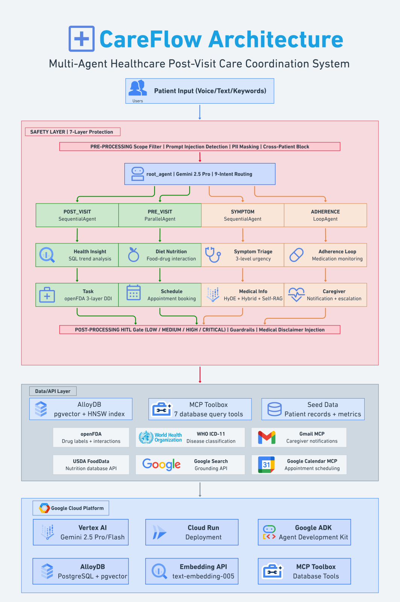
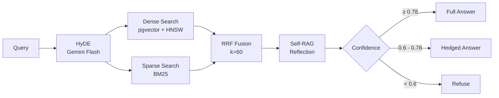

  

  <em>One doctor visit. Eight AI agents. Continuous care.</em>

  
  
  
  

  
  
  
  

---

## The Problem

- **537 million** adults worldwide live with diabetes — projected to reach 783M by 2045
- **50%** of chronic disease patients stop following treatment plans within 6 months
- The gap between "what the doctor said" and "what the patient actually does" costs **$528B annually** in preventable complications

## The Solution

CareFlow bridges the post-visit care gap with **8 specialized AI agents** orchestrated by a single `root_agent`, routing across 9 intent categories with real infrastructure — AlloyDB, 3 MCP integrations, and Agentic RAG.

<table>
<tr>
<td align="center" width="25%"><b>8 AI Agents</b> Smart routing care team</td>
<td align="center" width="25%"><b>7-Layer Safety</b> Medical-grade protection</td>
<td align="center" width="25%"><b>Agentic RAG</b> HyDE + Hybrid + Self-RAG</td>
<td align="center" width="25%"><b>Real Data</b> AlloyDB + pgvector</td>
</tr>
<tr>
<td align="center"><b>3 MCP Tools</b> Calendar, Gmail, DB</td>
<td align="center"><b>Voice I/O</b> STT + TTS</td>
<td align="center"><b>Drug Interaction</b> openFDA 3-layer cascade</td>
<td align="center"><b>Health Charts</b> BP, glucose, weight</td>
</tr>
</table>

## Architecture

  

### Agentic RAG Pipeline

## Tech Stack

**AI & Backend**

   

**Data & Infrastructure**

   

**Frontend**

  

---

*Built for Google Cloud Gen AI Academy APAC — Cohort 1 Hackathon*
